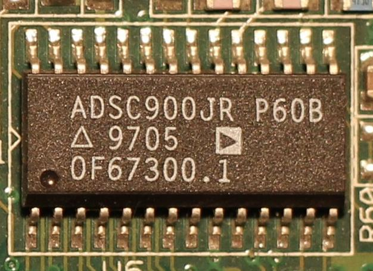
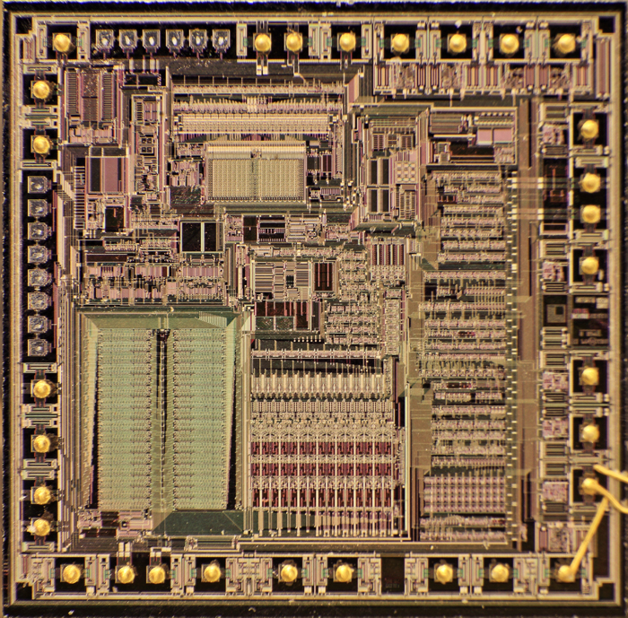
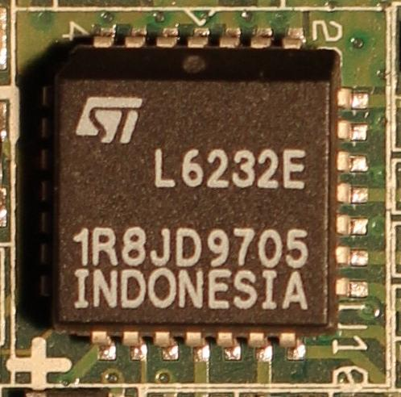
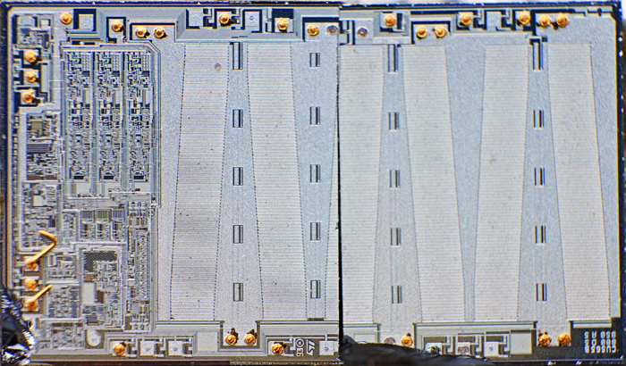
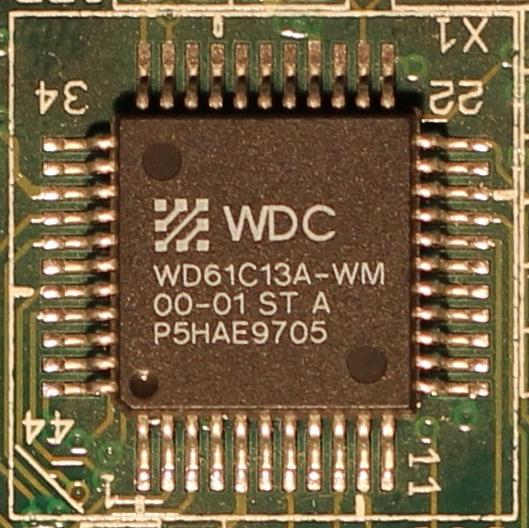
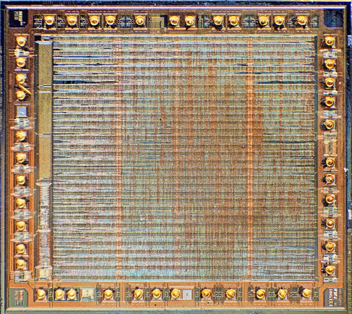
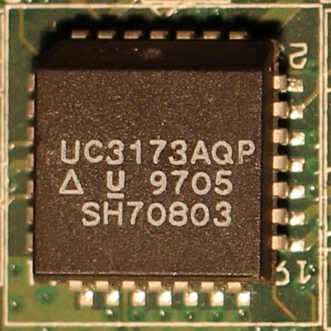
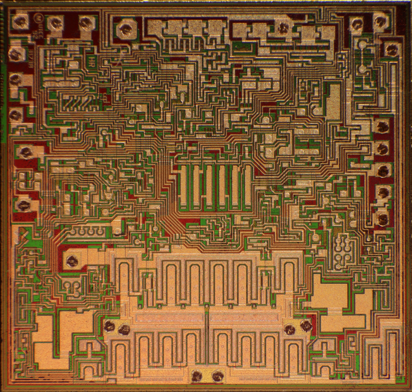
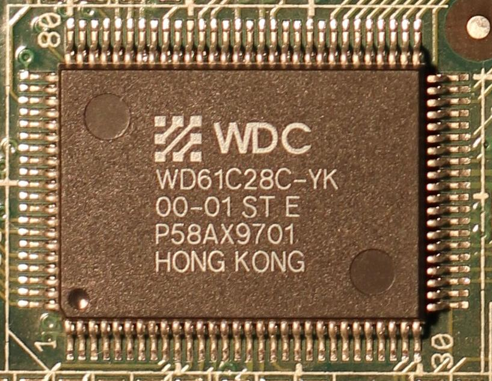
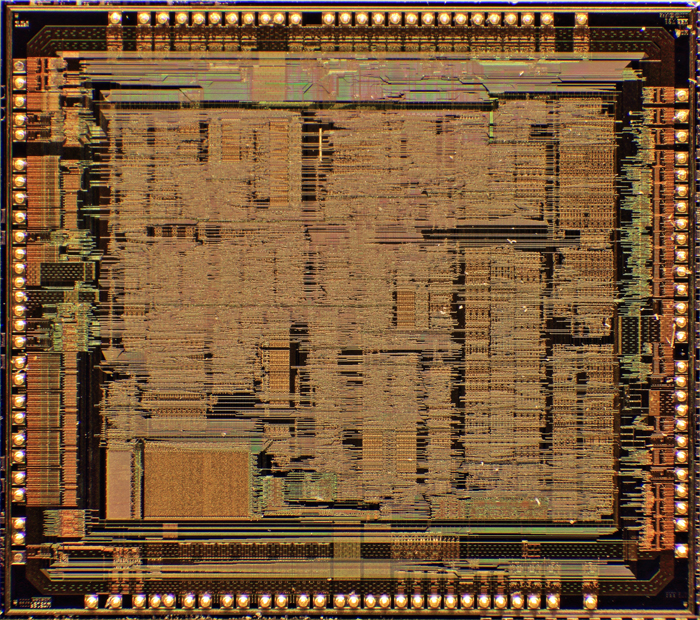

Файлы имеющие префикс «t_» - это попытки перевести документацию на русский язык.

Фотографии внутренностей микросхем взяты со страницы: https://www.richis-lab.de/HDD_WD_Caviar_22100.htm

**Преобразователь серво сигнала в цифровую форму:**

AD7775.pdf

t_AD7775.odg

t_AD7775.odt

t_AD7775.pdf

**ПЗУ:**

AT27C516-70JC-Atmel.pdf

**ОЗУ микроконтроллера:**

KM62256.pdf

**ОЗУ ATA буфера:**

TC511664B.PDF

**Управление шпиндельным двигателем:**

L6232.pdf

t_L6232.odt

t_L6232.pdf

t_L6232E_block_diagram.odg

t_L6232E_pin_diagram.odg

**Процессор:**

S80C196NU.pdf

**Канал чтения/записи**

SSI32P4904CG.pdf

t_SSI32P4904_block_diagram.odg

t_SSI32P4904_pin_diagram.odg

**Усилитель сигнала с головок:**

SSI32R2212.pdf

t_SSI32R2210R_2211R_2212R.odg

VM71110.pdf

**Управление позиционером головок:**

UC3173AQP.pdf

t_UC3173AQP.odg

t_UC3173AQP.odt

t_UC3173AQP.pdf

**Контроллер ATA интерфейса**

WD42C22_Winchester_Disk_Subsystem_Controller.pdf - описание на старый вариант контроллера интерфейса. 
Некоторые его регистры управления совпадают по функциональности. 
Thenx for this manual to http://www.bitsavers.org/components/

